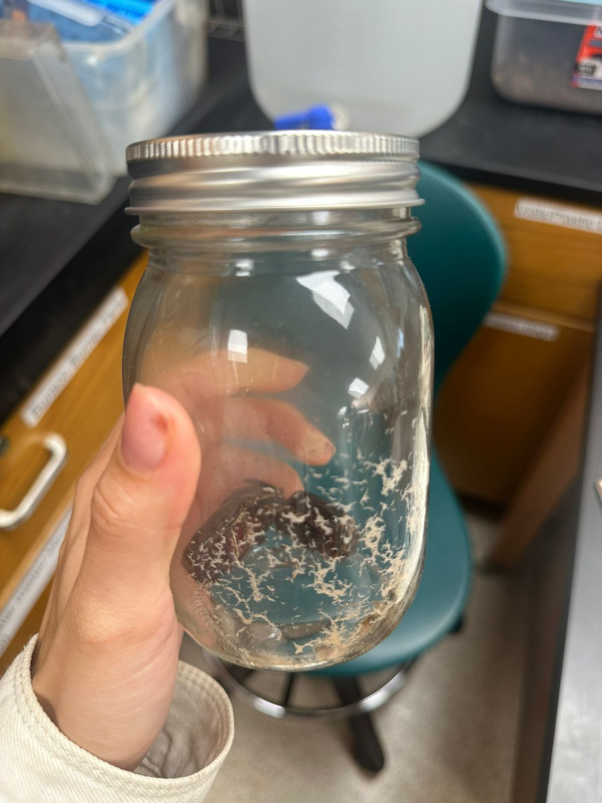
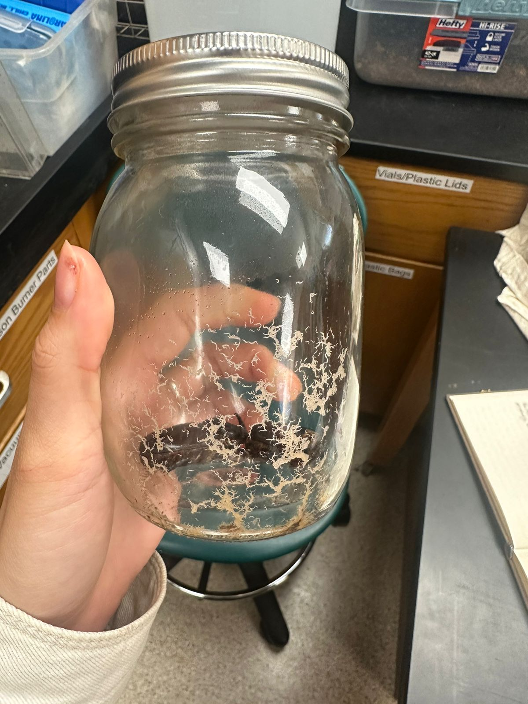

# CRB nematode observation from Laura Caser via WhatsApp 2024-03-30

>Hi Dr Moore. I collected beetles from a stump in Harmon a few weeks ago. They had no contact with coco peat as far as I’m aware. (I also mixed in some beetles from Ken, but I’m not sure if they had any contact with coco peat. I’ll check with him) they died and were placed into this jar on Wednesday. This morning it’s swarming with large nematodes.

